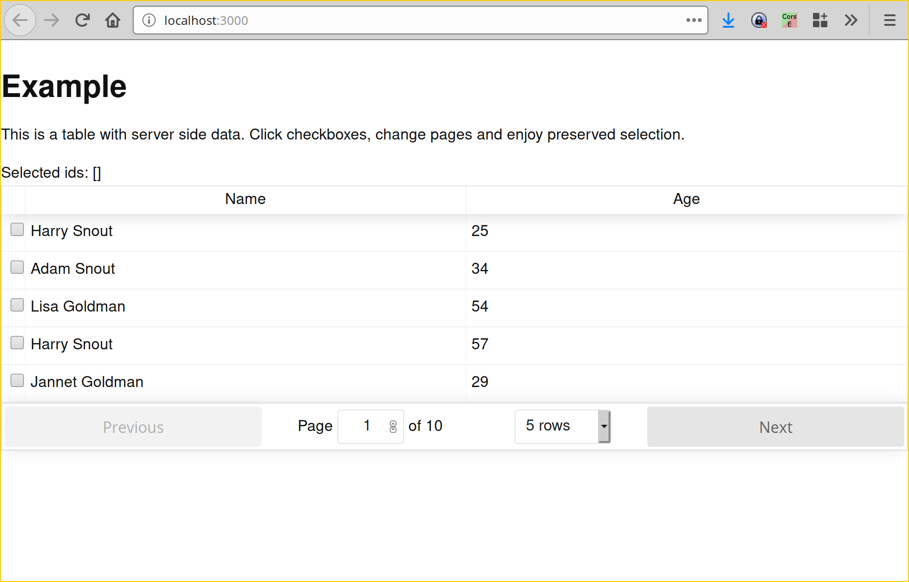
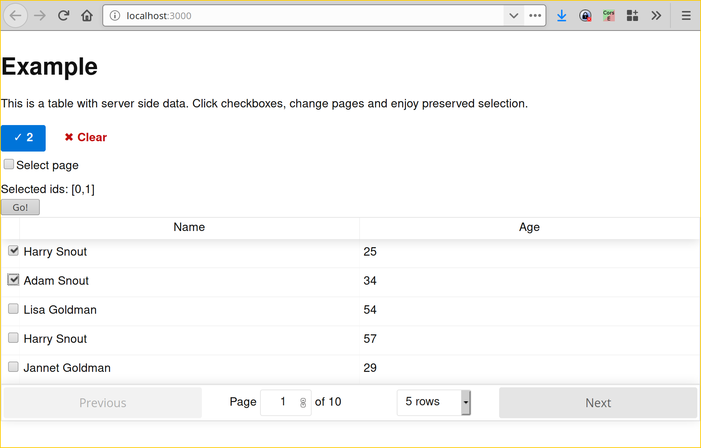
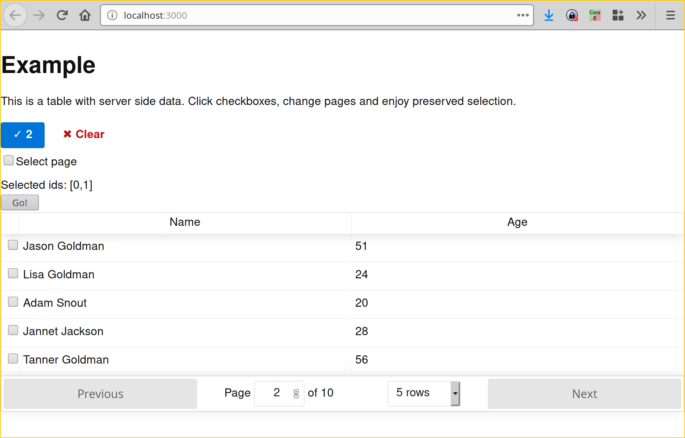

# Example for l21-selection-support

> Example of `l21-selection-support` use.
> It is an application with `react-table` showing  some data from server side.
> User wants to select rows, change pages and add more to the selection. Once selection is done, clicking on `GO` button will trigger an action.

### ExampleTable

[`ExampleTable.js`](src/ExampleTable.js) is how `l21-selection-support` can be used with `react-table`. Table generate rows with `SelectionCheckbox` inside and those add entries to selection within `<SelectionSupport>` range.

### ExampleAction

[`ExampleAction.js`](src/ExampleAction.js) is our custom action to carry out on selection. Here it just shows the list of selected items and pops up an alert on button click.

Note how `withSelection` was used to feed data to `ExampleAction`

## Screenshots

### Example table

Your normal react table with means to select an item: `SelectionCheckbox`. `SectionActions` are not enabled and not visible.

>

### An item is selected on page 1

Once checkbox is selected - an item is added to selection. That makes `SelectionActions` visible

>

### Page changed to 2

You can change page, filter data, sort column and reload data within your `react-trable`. Selection remains unless cancelled.
>
